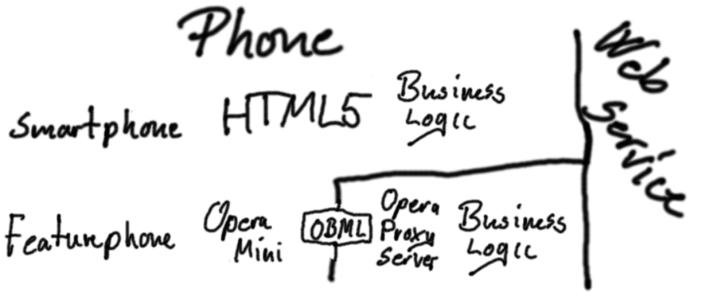

Vi sidder i spørgetjenesteprojektet forøjeblikket med et mobilplatforms-arkitekturvalg mellem to muligheder:

- den nuværende implementation (med super portablet abstraktionslag, der kan virke på tværs af alt)
- ren JavaScript implementation (dårligere platformsupport, men lettere at udvikle og vedligeholde, tilstrækkelig ifht. mobile.ting strategi)

og vil gerne have teknisk arkitekturforums holdning til hvilken retning der er at foretrække.

De følgende afsnit beskrive de to arkitekturmulighede, samt sammenligner dem. De er skrevet på engelsk da fagterminologien ellers ville give et rodet sprog.

# Current architecture

The current architecture consists of business logic in JavaScript, an abstraction layer, and three different backends to make it run as a smartphone app, a J2ME app, and a WAP-site.

An abstraction layer is implemented to make it possible to run the business logic across different platforms.  The abstraction layer supplies and encapsulates all the needed apis for GUI, storage, network etc.

The smartphone backend is created by implementing the abstraction layer on top of HTML5, and including this in a PhoneGap app. 
PhoneGap is a HTML5 / JavaScript packaging tool that makes it possible to use native features and create native-like-apps for most smartphone platforms.
The code used creating the app can also be used as a HTML5 web-site, as we are currently not using native features. 

The low-end phone app backend is done by implementing the abstraction layer on top of MIDP 1.0 (Mobile Information Device Profile, the api on Java Micro Edition supported phones). To be able to run the business logic, this also includes an interpreter for a subset of JavaScript designed for low-resource devices. 

The WAP-backend executes the business logic on the server-side, and generate static XHTML Mobile Profile pages which can be view on any WAP2 device (most mobile phones).

# JavaScript-App solution

Another option is to implement the solution purely in JavaScript and then require low-end phone user to install a recent web browser on their phone in order to access the services. Then services would then be implemented on top of a portable subset of HTML5, which can then be served directly or packaged as apps on smartphones.

On the low-end phones, JavaScript applications can be usable through the Opera Mini browser.
The JavaScript is executed on a remote server (at Opera) before the rendered content would be sent to the phone. 
This imposes some limitations, such as a a time limit of a couple of seconds on execution, and that only certain events trigger updates. 
It also imposes limitations on the GUI, as we would be bound to a subset of HTML5, and a lack of control on the drawing etc.

# Differences between the architectures

The current implementation makes it possible to deploy as apps(J2ME Midlets) on low-end phones, including offline-suppoet. With the JavaScript-App solution, there will only be app support on smartphones.

The current implementation can be accessed from low-end phones, without any addional installation. With the JavaScript-App solution the user would either need a recent smartphone, or have to manually install a modern browser, in order to access it.

The current implementation require maintaining and updating the abstraction layer and the 3 different backends.
A JavaScript-App architecture has less code maintenance.

The JavaScript-App approach allows easier access to the JavaScript/HTML/CSS-api, as it does not need to be abstract on three backends, but it also adds limitations as it is not possible to go beyond the HTML-model. (PhoneGap, J2ME and WAP-server allows integration with platform-specific code beyond html, example: networking)
